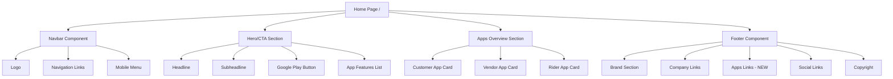

# Droptro Multi-App Platform Home Page Specification

## Project Overview

**Project Name:** Droptro Multi-App Platform  
**Tech Stack:** Next.js 14, Tailwind CSS v4, TypeScript  
**Primary Color:** #3B82F6 (Blue-500)  
**Current Status:** Specification Document  
**Version:** 1.0

---

## 1. Page Structure Overview



---

## 2. Responsive Breakpoints

| Breakpoint | Min Width | Description |
|------------|-----------|-------------|
| sm | 640px | Small tablets |
| md | 768px | Tablets landscape |
| lg | 1024px | Laptops |
| xl | 1280px | Desktops |
| 2xl | 1536px | Large screens |

---

## 3. Component Specifications

### 3.1 Navbar Component (Existing)

**File:** [`src/components/layout/Navbar.tsx`](src/components/layout/Navbar.tsx:1)

**Updates Required:** Add links to Vendor and Rider app pages

```typescript
// New navigation links to add
const navLinks = [
  { href: '/', label: 'Home' },
  { href: '/contact', label: 'Contact' },
  { href: '/vendor', label: 'Vendor App' },        // NEW
  { href: '/rider', label: 'Rider App' },           // NEW
];
```

---

### 3.2 Hero/CTA Section (NEW Design)

**File:** [`src/components/sections/HomeHero.tsx`](src/components/sections/HomeHero.tsx:1)

**Description:** Main hero section promoting the Customer App with Google Play Store download CTA

```typescript
// Component Structure
export function HomeHero() {
  return (
    <section className="relative overflow-hidden bg-gradient-to-b from-blue-50 to-white py-20 md:py-28 lg:py-32">
      {/* Background Pattern */}
      <div className="absolute inset-0 opacity-20">
        <svg className="h-full w-full" xmlns="http://www.w3.org/2000/svg">
          <defs>
            <pattern id="water-drop" width="60" height="60" patternUnits="userSpaceOnUse">
              <circle cx="30" cy="30" r="8" fill="#3B82F6" opacity="0.3"/>
            </pattern>
          </defs>
          <rect width="100%" height="100%" fill="url(#water-drop)" />
        </svg>
      </div>

      <div className="container relative mx-auto px-4">
        <div className="mx-auto max-w-4xl text-center">
          {/* Badge */}
          <div className="mb-6 inline-flex items-center rounded-full bg-blue-100 px-4 py-1.5 text-sm font-medium text-blue-800">
            <span className="mr-2">💧</span>
            Water Delivery Made Easy
          </div>

          {/* Headline */}
          <h1 className="mb-6 text-4xl font-bold tracking-tight text-gray-900 md:text-5xl lg:text-6xl">
            Your Water Delivery{' '}
            <span className="text-blue-600">Solution</span>
          </h1>

          {/* Subheadline */}
          <p className="mb-8 text-lg text-gray-600 md:text-xl lg:text-2xl">
            Order water from nearby vendors with the Droptro customer app.
            <br className="hidden md:block" />
            Fast, reliable, and convenient delivery at your fingertips.
          </p>

          {/* Google Play Store Button */}
          <div className="mb-10 flex flex-col items-center justify-center gap-4 sm:flex-row">
            <a
              href="https://play.google.com/store"
              target="_blank"
              rel="noopener noreferrer"
              className="flex items-center gap-3 rounded-xl bg-gray-900 px-6 py-3 text-white transition-transform hover:scale-105 hover:bg-gray-800 focus:outline-none focus:ring-2 focus:ring-blue-500 focus:ring-offset-2"
            >
              <svg className="h-8 w-8" viewBox="0 0 24 24" fill="currentColor">
                <path d="M3.609 1.814L13.792 12 3.61 22.186a.996.996 0 01-.61-.92V2.734a1 1 0 01.609-.92zm10.89 10.893l2.302 2.302-10.937 6.333 8.635-8.635zm3.199-3.198l2.807 1.626a1 1 0 010 1.73l-2.808 1.626L15.206 12l2.492-2.491zM5.864 2.658L16.8 8.99l-2.302 2.302-8.634-8.634z"/>
              </svg>
              <div className="text-left">
                <div className="text-xs text-gray-400">Download on the</div>
                <div className="text-lg font-semibold leading-none">Google Play</div>
              </div>
            </a>
          </div>

          {/* App Features Pills */}
          <div className="flex flex-wrap items-center justify-center gap-3 text-sm text-gray-600">
            <span className="inline-flex items-center rounded-full bg-white px-4 py-2 shadow-sm">
              <span className="mr-2 text-blue-600">✓</span>
              Quick Ordering
            </span>
            <span className="inline-flex items-center rounded-full bg-white px-4 py-2 shadow-sm">
              <span className="mr-2 text-blue-600">✓</span>
              Real-time Tracking
            </span>
            <span className="inline-flex items-center rounded-full bg-white px-4 py-2 shadow-sm">
              <span className="mr-2 text-blue-600">✓</span>
              Secure Payments
            </span>
            <span className="inline-flex items-center rounded-full bg-white px-4 py-2 shadow-sm">
              <span className="mr-2 text-blue-600">✓</span>
              24/7 Support
            </span>
          </div>
        </div>
      </div>
    </section>
  );
}
```

**Tailwind Classes Summary:**
- Section: `relative overflow-hidden bg-gradient-to-b from-blue-50 to-white py-20 md:py-28 lg:py-32`
- Container: `container relative mx-auto px-4`
- Headline: `text-4xl font-bold tracking-tight text-gray-900 md:text-5xl lg:text-6xl`
- Subheadline: `text-lg text-gray-600 md:text-xl lg:text-2xl`
- Google Play Button: `flex items-center gap-3 rounded-xl bg-gray-900 px-6 py-3 text-white hover:scale-105 hover:bg-gray-800`

---

### 3.3 Apps Overview Section (NEW Component)

**File:** [`src/components/sections/AppsOverview.tsx`](src/components/sections/AppsOverview.tsx:1)

**Description:** Three-column section showcasing Customer, Vendor, and Rider apps

```typescript
interface AppCardProps {
  title: string;
  tagline: string;
  description: string;
  features: string[];
  icon: string;
  color: string;
  ctaText: string;
  ctaLink: string;
}

const apps: AppCardProps[] = [
  {
    title: 'Customer App',
    tagline: 'Discover & Order',
    description: 'Find nearby vendors, browse products, and place orders with ease.',
    features: [
      'Browse nearby water vendors',
      'Compare prices and ratings',
      'One-click ordering',
      'Order history tracking',
    ],
    icon: '🛒',
    color: 'blue',
    ctaText: 'Download Customer App',
    ctaLink: '/customer',
  },
  {
    title: 'Vendor App',
    tagline: 'Manage Your Business',
    description: 'List products, manage inventory, and track orders efficiently.',
    features: [
      'Product catalog management',
      'Inventory tracking',
      'Order management',
      'Sales analytics',
    ],
    icon: '🏪',
    color: 'green',
    ctaText: 'Download Vendor App',
    ctaLink: '/vendor',
  },
  {
    title: 'Rider App',
    tagline: 'Deliver & Earn',
    description: 'Accept deliveries, navigate routes, and track your earnings.',
    features: [
      'Delivery requests',
      'Route optimization',
      'Earnings tracking',
      'Flexible schedule',
    ],
    icon: '🏍️',
    color: 'orange',
    ctaText: 'Download Rider App',
    ctaLink: '/rider',
  },
];

const colorClasses = {
  blue: {
    bg: 'bg-blue-50',
    border: 'border-blue-200',
    icon: 'bg-blue-100 text-blue-600',
    button: 'bg-blue-600 hover:bg-blue-700',
    accent: 'text-blue-600',
  },
  green: {
    bg: 'bg-green-50',
    border: 'border-green-200',
    icon: 'bg-green-100 text-green-600',
    button: 'bg-green-600 hover:bg-green-700',
    accent: 'text-green-600',
  },
  orange: {
    bg: 'bg-orange-50',
    border: 'border-orange-200',
    icon: 'bg-orange-100 text-orange-600',
    button: 'bg-orange-500 hover:bg-orange-600',
    accent: 'text-orange-600',
  },
};

export function AppsOverview() {
  return (
    <section className="bg-gray-50 py-20 md:py-24 lg:py-28">
      <div className="container mx-auto px-4">
        {/* Section Header */}
        <div className="mx-auto mb-16 max-w-3xl text-center">
          <h2 className="mb-4 text-3xl font-bold text-gray-900 md:text-4xl lg:text-5xl">
            One Platform,{' '}
            <span className="text-blue-600">Three Apps</span>
          </h2>
          <p className="text-lg text-gray-600">
            Whether you're a customer, vendor, or rider, Droptro has the perfect app for you.
          </p>
        </div>

        {/* App Cards Grid */}
        <div className="grid gap-8 md:grid-cols-2 lg:grid-cols-3">
          {apps.map((app, index) => {
            const colors = colorClasses[app.color as keyof typeof colorClasses];
            
            return (
              <div
                key={index}
                className={`group relative overflow-hidden rounded-2xl ${colors.bg} border ${colors.border} p-6 transition-all hover:shadow-xl`}
              >
                {/* Icon */}
                <div className={`mb-6 inline-flex h-16 w-16 items-center justify-center rounded-2xl ${colors.icon} text-3xl`}>
                  {app.icon}
                </div>

                {/* Tagline Badge */}
                <div className={`mb-3 inline-block rounded-full ${colors.bg} px-3 py-1 text-xs font-semibold ${colors.accent}`}>
                  {app.tagline}
                </div>

                {/* Title */}
                <h3 className="mb-3 text-2xl font-bold text-gray-900">
                  {app.title}
                </h3>

                {/* Description */}
                <p className="mb-6 text-gray-600">
                  {app.description}
                </p>

                {/* Features List */}
                <ul className="mb-8 space-y-3">
                  {app.features.map((feature, featureIndex) => (
                    <li key={featureIndex} className="flex items-start text-sm text-gray-700">
                      <svg className={`mr-2 mt-0.5 h-5 w-5 flex-shrink-0 ${colors.accent}`} fill="none" viewBox="0 0 24 24" stroke="currentColor">
                        <path strokeLinecap="round" strokeLinejoin="round" strokeWidth={2} d="M5 13l4 4L19 7" />
                      </svg>
                      {feature}
                    </li>
                  ))}
                </ul>

                {/* CTA Button */}
                <a
                  href={app.ctaLink}
                  className={`inline-flex w-full items-center justify-center rounded-xl ${colors.button} px-6 py-3 font-semibold text-white transition-all hover:shadow-lg`}
                >
                  {app.ctaText}
                  <svg className="ml-2 h-5 w-5" fill="none" viewBox="0 0 24 24" stroke="currentColor">
                    <path strokeLinecap="round" strokeLinejoin="round" strokeWidth={2} d="M17 8l4 4m0 0l-4 4m4-4H3" />
                  </svg>
                </a>
              </div>
            );
          })}
        </div>
      </div>
    </section>
  );
}
```

**Tailwind Classes Summary:**
- Section: `bg-gray-50 py-20 md:py-24 lg:py-28`
- Container: `container mx-auto px-4`
- Grid: `grid gap-8 md:grid-cols-2 lg:grid-cols-3`
- Card: `rounded-2xl border p-6 transition-all hover:shadow-xl`
- Title: `text-2xl font-bold text-gray-900`
- Features: `space-y-3 text-sm text-gray-700`

---

### 3.4 Footer Component (UPDATE)

**File:** [`src/components/layout/Footer.tsx`](src/components/layout/Footer.tsx:1)

**Updates Required:** Add new "Apps" section with Vendor and Rider app links

```typescript
// New footer links configuration
const footerLinks = {
  company: [
    { href: '/contact', label: 'Contact' },
    { href: '/privacy-policy', label: 'Privacy Policy' },
    { href: '/terms-and-conditions', label: 'Terms & Conditions' },
    { href: '/refund-policy', label: 'Refund Policy' },
  ],
  apps: [                                                              // NEW SECTION
    { href: '/customer', label: 'Customer App' },
    { href: '/vendor', label: 'Vendor App' },
    { href: '/rider', label: 'Rider App' },
  ],
  social: [
    { href: 'https://twitter.com', label: 'Twitter', external: true },
    { href: 'https://linkedin.com', label: 'LinkedIn', external: true },
    { href: 'https://github.com', label: 'GitHub', external: true },
  ],
};

// Updated grid layout
<div className="grid gap-8 md:grid-cols-4">     {/* Changed from 3 to 4 */}
  {/* Brand Section */}
  <div>...</div>
  
  {/* Company Links */}
  <div>...</div>
  
  {/* Apps Links - NEW */}
  <div>
    <h3 className="mb-4 text-sm font-semibold uppercase tracking-wider text-gray-900">
      Apps
    </h3>
    <ul className="space-y-3">
      {footerLinks.apps.map((link) => (
        <li key={link.href}>
          <Link
            href={link.href}
            className="text-sm text-gray-600 transition-colors hover:text-blue-600"
          >
            {link.label}
          </Link>
        </li>
      ))}
    </ul>
  </div>
  
  {/* Social Links */}
  <div>...</div>
</div>
```

---

## 4. Updated Home Page

**File:** [`src/app/page.tsx`](src/app/page.tsx:1)

```typescript
import { HomeHero } from '@/components/sections/HomeHero';
import { AppsOverview } from '@/components/sections/AppsOverview';

/**
 * Home Page
 * Main landing page for Droptro multi-app platform
 */
export default function Home() {
  return (
    <>
      <HomeHero />
      <AppsOverview />
    </>
  );
}
```

---

## 5. File Structure

```
src/
├── app/
│   ├── page.tsx                    # Updated home page
│   ├── layout.tsx                  # Root layout (no changes needed)
│   └── globals.css                 # Global styles (no changes needed)
├── components/
│   ├── layout/
│   │   ├── Navbar.tsx              # UPDATE: Add Vendor/Rider nav links
│   │   └── Footer.tsx              # UPDATE: Add Apps section
│   ├── sections/
│   │   ├── HomeHero.tsx            # NEW: Hero/CTA section
│   │   ├── AppsOverview.tsx        # NEW: Apps overview section
│   │   └── Hero.tsx                # EXISTING: Keep for other pages
│   └── ui/
│       ├── Button.tsx              # Existing component
│       └── Input.tsx               # Existing component
├── types/
│   └── index.ts                    # Existing types
└── public/
    └── images/
        └── logo.svg                # Existing logo
```

---

## 6. Color Palette

| Color Name | Hex Code | Usage |
|------------|----------|-------|
| Primary Blue | #3B82F6 | Primary buttons, links, accents |
| Blue-50 | #EFF6FF | Light backgrounds, badges |
| Blue-100 | #DBEAFE | Light accent backgrounds |
| Blue-600 | #2563EB | Primary button hover |
| Blue-700 | #1D4ED8 | Primary button active |
| Blue-800 | #1E40AF | Text accents |
| Gray-50 | #F9FAFB | Section backgrounds |
| Gray-100 | #F3F4F6 | Card backgrounds |
| Gray-200 | #E5E7EB | Borders |
| Gray-600 | #4B5563 | Secondary text |
| Gray-700 | #374151 | Body text |
| Gray-900 | #111827 | Headlines, dark buttons |
| Green-600 | #16A34A | Success states, vendor app |
| Orange-500 | #F97316 | Rider app accent |

---

## 7. Component States

### Button States

| State | Primary Button | Outline Button |
|-------|----------------|----------------|
| Default | `bg-blue-600 text-white` | `border-2 border-gray-300 text-gray-700` |
| Hover | `bg-blue-700` | `bg-gray-50` |
| Active | `bg-blue-800` | `bg-gray-100` |
| Focus | `ring-2 ring-blue-500 ring-offset-2` | `ring-2 ring-gray-500 ring-offset-2` |
| Disabled | `opacity-50 cursor-not-allowed` | `opacity-50 cursor-not-allowed` |

### Link States

| State | Color |
|-------|-------|
| Default | `text-gray-700` |
| Hover | `text-blue-600` |
| Focus | `outline-none ring-2 ring-blue-500` |

---

## 8. Responsive Behavior

### Mobile (< 640px)
- Hero: Single column, stacked elements
- Apps Overview: Single column, full-width cards
- Footer: Single column
- Navigation: Hamburger menu

### Tablet (640px - 1023px)
- Hero: Two-column layout possible
- Apps Overview: 2-column grid
- Footer: 2-column grid

### Desktop (≥ 1024px)
- Hero: Centered content, larger text
- Apps Overview: 3-column grid
- Footer: 4-column grid (Brand, Company, Apps, Social)
- menu

---

## Navigation: Full horizontal 9. Accessibility Requirements

- All interactive elements must be keyboard accessible
- Use semantic HTML5 elements (`<nav>`, `<section>`, `<footer>`)
- Include `aria-label` on icon-only buttons
- Ensure color contrast ratio ≥ 4.5:1 for text
- Use `focus:outline-none` and custom focus rings
- Include `rel="noopener noreferrer"` on external links

---

## 10. Implementation Checklist

- [ ] Create [`src/components/sections/HomeHero.tsx`](src/components/sections/HomeHero.tsx:1)
- [ ] Create [`src/components/sections/AppsOverview.tsx`](src/components/sections/AppsOverview.tsx:1)
- [ ] Update [`src/app/page.tsx`](src/app/page.tsx:1) to use new components
- [ ] Update [`src/components/layout/Navbar.tsx`](src/components/layout/Navbar.tsx:1) with new nav links
- [ ] Update [`src/components/layout/Footer.tsx`](src/components/layout/Footer.tsx:1) with Apps section
- [ ] Test responsive behavior across all breakpoints
- [ ] Verify accessibility compliance
- [ ] Test Google Play Store link

---

## 11. Design Preview

```mermaid
┌─────────────────────────────────────────────────────────────┐
│  DROPTRO    Home  Contact  Vendor App  Rider App    [☰]   │
├─────────────────────────────────────────────────────────────┤
│                                                             │
│                    💧 Water Delivery Made Easy              │
│                                                             │
│              Your Water Delivery Solution                  │
│                                                             │
│     Order water from nearby vendors with the Droptro       │
│     customer app. Fast, reliable, and convenient           │
│     delivery at your fingertips.                            │
│                                                             │
│        [📱 Download on the Google Play ]                    │
│                                                             │
│      ✓ Quick Ordering   ✓ Real-time Tracking   ✓ ...       │
│                                                             │
├─────────────────────────────────────────────────────────────┤
│                                                             │
│           One Platform, Three Apps                          │
│                                                             │
│  ┌─────────────┐  ┌─────────────┐  ┌─────────────┐        │
│  │    🛒       │  │    🏪       │  │    🏍️       │        │
│  │Discover...  │  │Manage...   │  │Deliver...   │        │
│  │             │  │             │  │             │        │
│  │Customer App │  │ Vendor App  │  │ Rider App   │        │
│  │             │  │             │  │             │        │
│  │• Browse...  │  │• Products   │  │• Delivery   │        │
│  │• Compare... │  │• Inventory  │  │• Routes     │        │
│  │• Order...   │  │• Orders     │  │• Earnings   │        │
│  │             │  │             │  │             │        │
│  │[Download]   │  │[Download]   │  │[Download]   │        │
│  └─────────────┘  └─────────────┘  └─────────────┘        │
│                                                             │
├─────────────────────────────────────────────────────────────┤
│  DROPTRO          Company              Apps       Connect  │
│  Building the...  Contact              Customer   Twitter  │
│  future of...     Privacy              Vendor     LinkedIn  │
│  water...         Terms                Rider      GitHub    │
│                   Refund                                        │
│                                                             │
│                    © 2024 Droptro. All rights reserved.      │
└─────────────────────────────────────────────────────────────┘
```

---

## 12. Summary

This specification provides:

1. **Complete component specifications** with exact Tailwind CSS classes
2. **Responsive design guidelines** for mobile, tablet, and desktop
3. **Clear file structure** indicating which files to create and update
4. **Design consistency** with existing branding (blue primary #3B82F6)
5. **Accessibility considerations** for WCAG compliance

The implementation can be handed off to Code mode for actual component creation.
